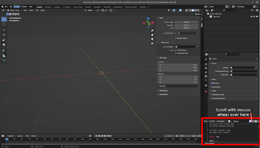
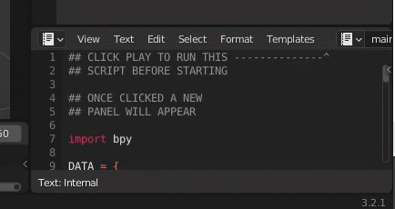
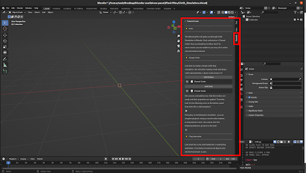

# COMP477 Capsules

The following .blend files are ready to use Blender files that contain tutorials on various topics

- Cloth animation Blender
- Inverse Kinematics
- Rigid bodies Blender
- Fluid simulation Blender
- SMPL Blender

## How To

First download Blender 3.0 from https://www.blender.org/download/

Each capsule is a Blender 3.0 file - you may be able to double click and open it OR open Blender and then File > Open and select the .blend file. Once open look on the bottom right and you will see the scripting tab (highlighted below)

The play icon may be hidden so scroll with mouse wheel on where it says “Templates” until you see the play button and then click it (shown below)

This will create a new menu with the tutorial - follow the steps mentioned in it. You will need to do this for all the capsules

